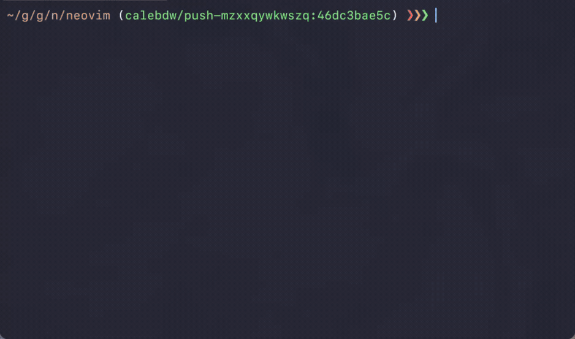

# ghsigns.nvim

[日本語版はこちら](#日本語)

A Neovim plugin that integrates [gitsigns.nvim](https://github.com/lewis6991/gitsigns.nvim) with GitHub CLI to automatically display Pull Request information in your statusline and show diffs against the PR's base branch.



## Features

- Automatically fetches PR information for the current branch using GitHub CLI
- Displays branch name and PR number in Lualine with colorful highlights
- **Interactive PR information display**:
  - Single-click the Lualine component to view detailed PR information in a floating window
  - Double-click to open the PR in your browser
- **Rich floating window with**:
  - PR title, draft status, author, state, review decision, mergeable status
  - Branch information, labels, dates (created, updated, merged)
  - Line changes, file count, and commit count
  - Markdown-rendered PR description with syntax highlighting
  - Clickable links (`[text](url)` format and `#123` issue/PR references)
  - Auto-close when clicking outside or pressing q/Esc/Enter
- Automatically changes the diff base to the PR's base branch (using gitsigns' `change_base` feature)
- Caches PR information for better performance
- Asynchronous PR fetching to avoid blocking the editor

## Screenshots


The Lualine component displays the current branch (`calebdw/push-mzxxqywkwszq`), base branch (`master`), and PR number (`#38006`) with colorful syntax highlighting.

## Requirements

- [Neovim](https://neovim.io/) >= 0.9.0
- [gitsigns.nvim](https://github.com/lewis6991/gitsigns.nvim) (required)
- [GitHub CLI (`gh`)](https://cli.github.com/) (required)
- [md-render.nvim](https://github.com/delphinus/md-render.nvim) (optional — see below)
- [lualine.nvim](https://github.com/nvim-lualine/lualine.nvim) (optional, for statusline integration)

### md-render.nvim (optional)

[md-render.nvim](https://github.com/delphinus/md-render.nvim) is a standalone Markdown rendering engine extracted from this plugin. Installing it enables:

- **PR floating window** — single-click the Lualine component to view PR details with rich Markdown rendering (headings, bold, code, links, tables, GitHub/Obsidian callouts, treesitter syntax highlighting in code blocks, etc.)
- **Markdown preview** — preview any Markdown file in a floating window via `require("ghsigns.md_preview").show()`

Without md-render.nvim, ghsigns.nvim still works — single-click will open the PR in your browser instead of showing the floating window. All core features (Lualine display, automatic diff base switching, PR caching) remain fully functional.

## Installation

### Using [lazy.nvim](https://github.com/folke/lazy.nvim)

```lua
{
  "delphinus/ghsigns.nvim",
  version = "*",
  dependencies = {
    "lewis6991/gitsigns.nvim",
    { "delphinus/md-render.nvim", version = "*" }, -- optional: for PR floating window & Markdown preview
  },
  config = function()
    require("ghsigns").setup()
  end,
}
```

## Configuration

### Basic Setup

```lua
require("ghsigns").setup()
```

### Custom Configuration

```lua
require("ghsigns").setup({
  -- Path to the gh binary (default: "gh")
  bin = "gh",

  -- Custom colors for the Lualine component
  colors = {
    icon = { fg = "#dddde7" },  -- Git branch icon
    head = { fg = "#d087e8" },  -- Current branch name
    arrow = { fg = "#e7a06a" }, -- Arrow symbol
    base = { fg = "#73a3f3" },  -- Base branch name and PR number
  },
})
```

### Lualine Integration

Add the ghsigns component to your Lualine configuration:

```lua
require("lualine").setup({
  sections = {
    lualine_a = { "mode" },
    lualine_b = {
      require("ghsigns.lualine").component(),
    },
    -- ... other sections
  },
})
```

The Lualine component displays:
- `  main` - When on a branch without a PR
- `  feature-branch ← main #123` - When on a branch with PR #123 targeting main

**Mouse interactions**:
- **Single-click**: Display detailed PR information in a floating window with:
  - Title, author, state, review status, mergeable status
  - Changes summary with file/commit counts
  - Labels and important dates
  - Markdown-rendered description with clickable links
- **Double-click**: Open the PR in your browser

## How It Works

1. ghsigns listens to the `GitSignsUpdate` event from gitsigns.nvim
2. When triggered, it fetches PR information for the current branch using `gh pr view`
3. If a PR is found, it automatically changes the diff base to the PR's base branch
4. PR information is cached by repository root and branch name to minimize API calls
5. The Lualine component displays the current branch, base branch, and PR number

## TODO / Roadmap

- [ ] Support for remote repositories other than `origin`
- [ ] Customizable statusline display items
- [ ] Support for statusline plugins other than Lualine
- [ ] Customizable floating window content and layout

Contributions and feature requests are welcome!

## Development / Testing

This plugin includes comprehensive test suites using [plenary.nvim](https://github.com/nvim-lua/plenary.nvim).

### Running Tests

```bash
# Run all tests
make test

# Run markdown rendering tests only
make test-markdown

# Run lualine module tests only
make test-lualine
```

### Test Coverage

- **Markdown Rendering** (`tests/markdown_spec.lua`): Tests for the markdown parser that handles PR descriptions
  - Headings, links, bold text, inline code
  - Issue/PR references (#123)
  - List items
  - CR character handling

- **Lualine Module** (`tests/lualine_spec.lua`): Tests for the lualine component and PR display
  - Click handlers (single/double click)
  - Floating window creation and management
  - PR information display

### Releasing

1. Update CHANGELOG.md with git-cliff and commit:

```bash
git-cliff --output CHANGELOG.md
git add CHANGELOG.md
git commit -m "docs: update CHANGELOG.md for vX.Y.Z"
```

2. Merge the changes into `main` via a pull request.

3. Create and push a version tag:

```bash
git tag vX.Y.Z
git push origin vX.Y.Z
```

The release workflow will verify that CHANGELOG.md contains the version entry,
generate release notes with git-cliff, and create a GitHub Release automatically.

## License

MIT

---

# 日本語

[gitsigns.nvim](https://github.com/lewis6991/gitsigns.nvim) と GitHub CLI を統合し、ステータスラインに Pull Request 情報を自動表示し、PR のベースブランチとの差分を表示する Neovim プラグインです。


## 機能

- GitHub CLI を使用して現在のブランチの PR 情報を自動取得
- Lualine にブランチ名と PR 番号をカラフルに表示
- **インタラクティブな PR 情報表示**:
  - シングルクリック: Floating Window で詳細な PR 情報を表示
  - ダブルクリック: ブラウザで PR を開く
- **豊富な Floating Window 機能**:
  - PR タイトル、Draft 状態、作者、状態、レビュー判定、マージ可能性
  - ブランチ情報、ラベル、日付（作成、更新、マージ）
  - 変更行数、ファイル数、コミット数
  - シンタックスハイライト付き Markdown レンダリング
  - クリック可能なリンク（`[text](url)` 形式と `#123` issue/PR 参照）
  - 外側クリックまたは q/Esc/Enter で自動クローズ
- PR のベースブランチに対する差分を自動表示（gitsigns の `change_base` 機能を使用）
- PR 情報をキャッシュしてパフォーマンスを向上
- 非同期 PR 取得でエディタをブロックしない

## スクリーンショット


Lualine コンポーネントは、現在のブランチ（`calebdw/push-mzxxqywkwszq`）、ベースブランチ（`master`）、PR 番号（`#38006`）をカラフルに表示します。

## 必要要件

- [Neovim](https://neovim.io/) >= 0.9.0
- [gitsigns.nvim](https://github.com/lewis6991/gitsigns.nvim)（必須）
- [GitHub CLI (`gh`)](https://cli.github.com/)（必須）
- [md-render.nvim](https://github.com/delphinus/md-render.nvim)（オプション — 下記参照）
- [lualine.nvim](https://github.com/nvim-lualine/lualine.nvim)（オプション、ステータスライン統合用）

### md-render.nvim（オプション）

[md-render.nvim](https://github.com/delphinus/md-render.nvim) はこのプラグインから分離された Markdown レンダリングエンジンです。インストールすると以下の機能が有効になります：

- **PR フローティングウィンドウ** — Lualine コンポーネントをシングルクリックすると、リッチな Markdown レンダリング付きで PR 詳細を表示（見出し、太字、コード、リンク、テーブル、GitHub/Obsidian コールアウト、コードブロック内の treesitter シンタックスハイライトなど）
- **Markdown プレビュー** — `require("ghsigns.md_preview").show()` で任意の Markdown ファイルをフローティングウィンドウでプレビュー

md-render.nvim がなくても ghsigns.nvim は動作します。その場合、シングルクリックではフローティングウィンドウの代わりにブラウザで PR を開きます。コア機能（Lualine 表示、自動 diff base 切り替え、PR キャッシュ）は全て利用可能です。

## インストール

### [lazy.nvim](https://github.com/folke/lazy.nvim) を使用

```lua
{
  "delphinus/ghsigns.nvim",
  version = "*",
  dependencies = {
    "lewis6991/gitsigns.nvim",
    { "delphinus/md-render.nvim", version = "*" }, -- オプション: PR フローティングウィンドウ & Markdown プレビュー
  },
  config = function()
    require("ghsigns").setup()
  end,
}
```

## 設定

### 基本設定

```lua
require("ghsigns").setup()
```

### カスタム設定

```lua
require("ghsigns").setup({
  -- gh コマンドのパス（デフォルト: "gh"）
  bin = "gh",

  -- Lualine コンポーネントのカスタムカラー
  colors = {
    icon = { fg = "#dddde7" },  -- Git ブランチアイコン
    head = { fg = "#d087e8" },  -- 現在のブランチ名
    arrow = { fg = "#e7a06a" }, -- 矢印記号
    base = { fg = "#73a3f3" },  -- ベースブランチ名と PR 番号
  },
})
```

### Lualine 統合

Lualine の設定に ghsigns コンポーネントを追加します：

```lua
require("lualine").setup({
  sections = {
    lualine_a = { "mode" },
    lualine_b = {
      require("ghsigns.lualine").component(),
    },
    -- ... その他のセクション
  },
})
```

Lualine コンポーネントの表示：
- `  main` - PR がないブランチの場合
- `  feature-branch ← main #123` - main をターゲットとする PR #123 があるブランチの場合

**マウス操作**:
- **シングルクリック**: Floating Window で詳細な PR 情報を表示
  - タイトル、作者、状態、レビュー状態、マージ可能性
  - ファイル/コミット数を含む変更サマリー
  - ラベルと重要な日付
  - クリック可能なリンク付き Markdown レンダリングされた説明
- **ダブルクリック**: ブラウザで PR を開く

## 動作の仕組み

1. ghsigns は gitsigns.nvim の `GitSignsUpdate` イベントをリッスン
2. トリガーされると、`gh pr view` を使用して現在のブランチの PR 情報を取得
3. PR が見つかると、差分ベースを PR のベースブランチに自動変更
4. PR 情報はリポジトリルートとブランチ名でキャッシュされ、API 呼び出しを最小化
5. Lualine コンポーネントに現在のブランチ、ベースブランチ、PR 番号を表示

## TODO / ロードマップ

- [ ] `origin` 以外のリモートリポジトリへの対応
- [ ] ステータスラインの表示項目をカスタマイズ可能に
- [ ] Lualine 以外のステータスラインプラグインへの対応
- [ ] Floating Window の内容とレイアウトをカスタマイズ可能に

コントリビューションや機能リクエストを歓迎します！

## 開発 / テスト

このプラグインには [plenary.nvim](https://github.com/nvim-lua/plenary.nvim) を使用した包括的なテストスイートが含まれています。

### テストの実行

```bash
# すべてのテストを実行
make test

# Markdown レンダリングのテストのみ実行
make test-markdown

# Lualine モジュールのテストのみ実行
make test-lualine
```

### テストカバレッジ

- **Markdown レンダリング** (`tests/markdown_spec.lua`): PR 説明文を処理する Markdown パーサーのテスト
  - 見出し、リンク、太字、インラインコード
  - Issue/PR 参照 (#123)
  - リスト項目
  - CR 文字の処理

- **Lualine モジュール** (`tests/lualine_spec.lua`): Lualine コンポーネントと PR 表示のテスト
  - クリックハンドラー（シングル/ダブルクリック）
  - フローティングウィンドウの作成と管理
  - PR 情報の表示

### リリース

1. git-cliff で CHANGELOG.md を更新してコミット:

```bash
git-cliff --output CHANGELOG.md
git add CHANGELOG.md
git commit -m "docs: update CHANGELOG.md for vX.Y.Z"
```

2. Pull Request 経由で `main` にマージ。

3. バージョンタグを作成して push:

```bash
git tag vX.Y.Z
git push origin vX.Y.Z
```

リリースワークフローが CHANGELOG.md にバージョンエントリがあることを検証し、
git-cliff でリリースノートを生成して GitHub Release を自動作成します。

## ライセンス

MIT
